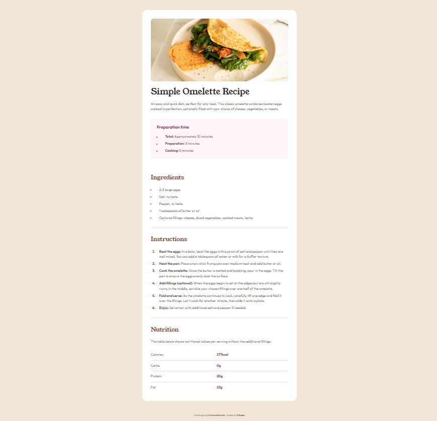

# Frontend Mentor - Recipe page solution

Это решение челленджа [Recipe page на Frontend Mentor](https://www.frontendmentor.io/challenges/recipe-page-KiTsR8QQKm). Frontend Mentor помогает улучшить навыки программирования через создание реалистичных проектов.

## Содержание

- [Frontend Mentor - Recipe page solution](#frontend-mentor---recipe-page-solution)
  - [Содержание](#содержание)
  - [Обзор](#обзор)
    - [Скриншот](#скриншот)
    - [Ссылки](#ссылки)
  - [Процесс работы](#процесс-работы)
    - [Технологии](#технологии)
    - [Что я изучила](#что-я-изучила)

## Обзор

### Скриншот



### Ссылки

- Live Site: [https://FilSado.github.io/recipe-page/](https://filsado.github.io/recipe-page/)
- GitHub репозиторий: [https://github.com/FilSado/recipe-page](https://github.com/FilSado/recipe-page)

## Процесс работы

### Технологии

- Семантический HTML5
- CSS кастомные свойства (переменные)
- Flexbox для выравнивания
- БЭМ методология для именования классов
- Mobile-first подход
- Google Fonts (Young Serif, Outfit)
- HTML таблицы для nutrition facts
- Упорядоченные и неупорядоченные списки

### Что я изучила

Во время работы над этим проектом я освоила важные концепции семантического HTML:

**1. Правильное использование семантических тегов:**
```html
<main>
  <article class="recipe-card">
    <header class="recipe-card__header">
      <h1>Simple Omelette Recipe</h1>
    </header>
    <section> class="preparation-time">
      <!-- Дополнительная информация -->
    </section>
    <section class="recipe-section">
      <!-- Ингредиенты, инструкции -->
    </section>
  </article>
</main>
```
**2. Работа с упорядоченными и неупорядоченными списками:**

xml
<!-- Неупорядоченный список для ингредиентов -->
<ul class="recipe-section__list">
  <li>2-3 large eggs</li>
</ul>

<!-- Упорядоченный список для инструкций (шаги) -->
<ol class="recipe-section__list--ordered">
  <li><strong>Beat the eggs:</strong> ...</li>
</ol>

**3. HTML таблицы для табличных данных:**

xml
<table class="nutrition-table">
  <tbody>
    <tr>
      <td>Calories</td>
      <td><strong>277kcal</strong></td>
    </tr>
  </tbody>
</table>
